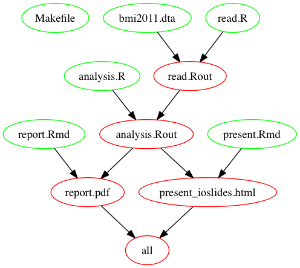

<!--    logo: 2015/images/2004xmas_0906.JPG  -->
<!--      highlight: pygments-->

<!--   >

<!-- uq-logo.jpg -->

<style type="text/css">
 
<!--
/* Your other css */

.section .reveal .state-background {
    background: url(./2015/images/dryCreek.jpg);
    background-position: center center;
    background-attachment: fixed;
    background-repeat: no-repeat;
    background-size: 100% 100%;
}
-->

body, td {
   font-size: 14px;
}
code.r{
  font-size: 24px;
}
pre {
  font-size: 24px
}
</style>

## Outline

- Background
- Data analysis project workflow
- Make
- Git and Make in tandem
- Conclusions

<!--  -->


## My Background

- Many years as a statistical consultant
    - NSW Agriculture, CSIRO, UQ Public Health
    - agricultural, genetics, medical and epidemiological researchers
- Statistical software
    - GENSTAT, Minitab, SAS, SPSS, STATA, S, ...
    - R (almost) exclusively since 2001	

## Real world consulting

Are these scenarios familiar?

> - I have a very simple question that will only take 5 minutes. I won't need to see you again

> - We have several data points that need deleting. Can you rerun the analysis, and insert the new tables and plot into our report by 4pm today?

> - The journal got back to us: Can you rerun the analysis to take account critisicms of our method? Its not the project we did last year but the one from 2009

## Real world consulting

No matter what clients/funders/bosses say, what happens is often very different

**All** these situations need to be well organised and well documented 

Standardised systems help too

Additionally, good computing tools (**R** and **non R**) can help this process too

> - **Reproducible Research essential**

> - **Make can be *integral* to reproducible research**

## Reproducible Research: Rerunning analysis

- manually
    - need to document steps heavily
    - still may forget something
- *make* [@mecklenburg2004] and [@graham-cumming_gnu_2015]
    - automates process
    - only rerun steps needed
    - keeps track of the process
        - but need to read/tweak *make*

> - also make batch SAS, SPSS, stata, perl, python, sed, awk, ....

<!-- {Makefile, highlight = TRUE, eval = FALSE} -->


## Simple Makefile

- Easy to set up and run

target: dependencies<br>
  \<TAB\> command to run
  
- Makefile

```
    .PHONY: all
    all: read.Rout
    
    read.Rout: read.R bmi2011.dta
    <TAB>   R CMD BATCH --vanilla read.R
```

- type *make* at shell or set up *Build* in *RStudio* or *ESS*, ...
- only runs command if target older than dependencies

## Comments on make

- no changes to *R* syntax or *.dta* file. Run make

```
     make: Nothing to be done for `all'.
```

- if changes to *R* syntax and/or *.dta* file. Run make

    + **read.Rout** gets rebuilt because make runs *R*
	
* using *make* for complicated projects
     + helps minimise errors in re-running
     + can use automatic variables $@, $<, ..... 
     + could simplify syntax if we had rules for *R*
     + can use variables to define programs/options


## DAG for Makefile



## No standard Make rules for R

**No Problem**

- write your own rules, or
- include file *common.mk* from <br> https://github.com/petebaker/r-makefile-definitions

```
    .PHONY: all                 # read file from bottom up
    all: report.pdf present_ioslides.html
    
    report.pdf: ${@:.pdf=.Rmd} analysis.Rout
	present_ioslides.html: present.Rmd analysis.Rout 
    analysis.Rout: ${@:.Rout=.R} read.Rout
    read.Rout: ${@:.Rout=.R} bmi2011.dta
    include ~/lib/common.mk
```

## **common.mk**: predefined rules (R files)

- output/notebooks from .R using *rmarkdown*

```
     # standard 'R CMD BATCH -vanilla' output from R file
     %.Rout: %.R
	 
	 # notebook documents from .R 
     %.docx: %.R
     %.html: %.R
     %.pdf: %.R
```

- R syntax from .Rmd/.Rnw using *knitr*

```
     # R syntax from Rmd/Rnw
     %.R: %.Rmd
     %.R: %.Rnw
```

## **common.mk**: predefined rules (Rmd/Rnw files)

```
    # Documents & presentations from Rmd (rmarkdown)
    %.docx: %.Rmd
    %.html: %.Rmd
    %.odt: %.Rmd
    %.pdf: %.Rmd
    %.rtf: %.Rmd
    %_beamer.pdf: %.Rmd
    %_ioslides.html: %.Rmd
    %_slidy.html: %.Rmd
    %_tufte.pdf: %.Rmd
    
	# Document from .Rnw file (knitr/latex)
    %.pdf: %.Rnw
```

## **common.mk**: predefined rules (beamer Rnw files)

```
%_Present.pdf: %_Present.Rnw
%_Present.Rnw: %.Rnw $(BEAMER_PRESENT)

%_Article.pdf: %_Article.Rnw
%_Article.Rnw: %.Rnw $(BEAMER_ARTICLE)
%_Notes.pdf: %_Notes.Rnw
%_Notes.Rnw: %.Rnw $(BEAMER_NOTES)

%_Handout.pdf: %_Handout.Rnw
%_Handout.Rnw: %.Rnw $(BEAMER_HANDOUT)
%-2up.pdf: %_Handout.pdf
%-3up.pdf: %_Handout.pdf
%-4up.pdf: %_Handout.pdf
%-6up.pdf: %_Handout.pdf

%-syntax.R: %.Rnw
```
## **common.mk**: definitions for pdf targets

```
RMARKDOWN_PDF_OPTS = (fig_crop=FALSE, fig_caption = TRUE)
RSCRIPT   = Rscript
RSCRIPT_OPTS = --vanilla

## .pdf from .R file (via rmrkdown/latex)
%.pdf: %.R
<TAB> ${RSCRIPT} ${RSCRIPT_OPTS} -e "library(rmarkdown);render(\"${@:.pdf=.R}\", pdf_document${RMARKDOWN_PDF_OPTS})"
## .pdf from .Rmd (via rmarkdown/latex)
%.pdf: %.Rmd
<TAB> ${RSCRIPT} ${RSCRIPT_OPTS} -e "library(rmarkdown);render(\"${@:.pdf=.Rmd}\", pdf_document${RMARKDOWN_PDF_OPTS})"
```
NB: Change variables after including **common.mk**

## **common.mk**: comments

* Include definitions file with 'include'

* Flexible: use variables to modify
    + R versions
    + R CMD or RScript
    + options to R, rmarkdown etc

Help can be obtained with
```
    make help
	make help-r
	make help-rmarkdown
```
etc

## Using *git* and *make*

- Version control helps all projects

- Check out minimal set of necessary files

- run *make all*

Good info online or see [@loeliger_version_2012]

## Limitations

- make designed for creating executables but still useful for data anlysis

- <TAB> be careful when cutting and pasting

- recursive make may be tricky (**makepp**)

- alternatives available but not as widely used

## Conclusions

- **make** useful for automating data analysis steps
    - only minimal no. of  targets are rebuilt
- **R** definitions available
- modifiable via setting variables or definitions themselves

.


Make definitions available at https://github.com/petebaker/r-makefile-definitions

See blog: http://www.petebaker.id.au  or twitter:  \@pjbstats

## References

